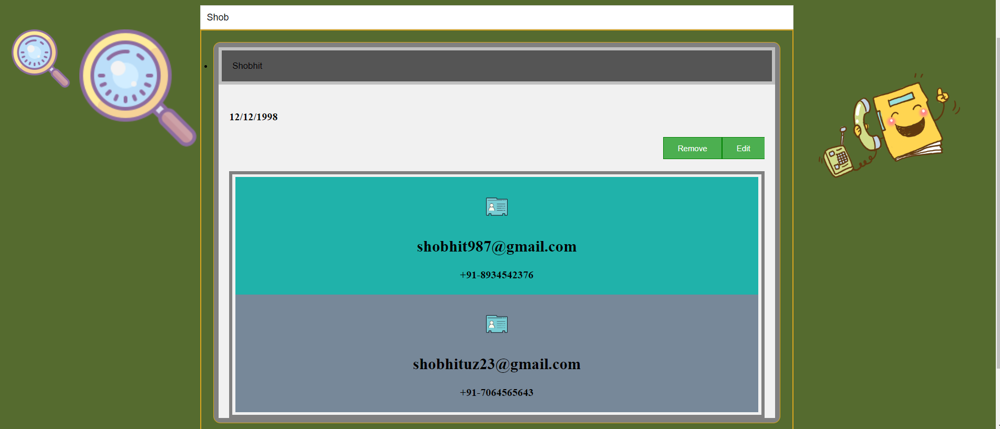

<h1>This is my Homepage of Phone Book Web App ,here i have used Nodejs to work with server and client using protocol http request and for server response is TCP</h1>
 <h1>In this User can search with Alphabetical order and create new user , also it has Collapsible dropdown feature in which user can edit and remove as per his/her Updated Information</h1>

  
<h1>Search with Alphabatical order</h1>

  
<h1>User Can see their details by searching and also can do edit and move it to trash</h1>

 
 
<h1>User will be having options to edit or delete </h1>

 
 
<h1>Provided pagination to the HomePage to easily navigate </h1>

 
 
<h1>Edit Page </h1>

 
 
<h1>Create New User </h1>

